<table align="center">
<tr>
<td width="120px" align="center">
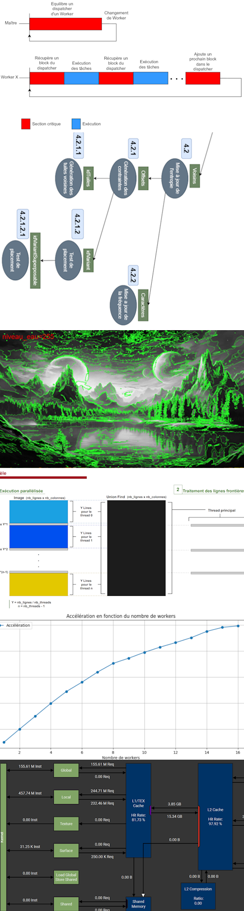
</td>

<td align="center">

<b>HPC • GPU Computing • Rendering</b> 
Engineering student focused on performance, systems and physics-based rendering. 
I enjoy designing high-performance, low-level solutions and tackling complex technical problems.

🎓 <b>Master CHPS (High Performance Computing & Simulation)</b> — URCA, Reims (M2, Major M1) 
🎓 <b>BSc Computer Science</b> — URCA, Reims (Ranked 1st)

💼 <b>Research Apprentice</b> @ LICIIS (2024–Present) — Vegetation Rendering 
💼 <b>Software Engineer Intern</b> @ Nanogiga (2024)

❤️ Passionate · 🧠 Curious · ⚙️ Independent 
♟️ Chess · 💻 Computing · 🎨 Drawing · 🎮 Video Games

</td>

<td width="120px" align="center">
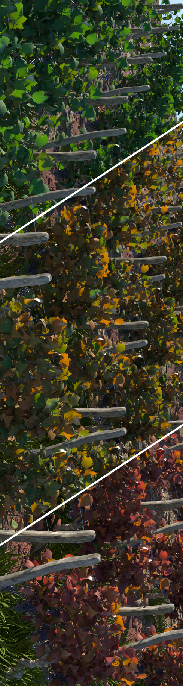
</td>
</tr>
</table>

---

---

## 🔬 Skills

### High Performance Computing & Optimization

Advanced understanding of **CPU/GPU performance**, **memory hierarchies**, and **optimization**.

- SIMD vectorization, cache-aware algorithms, temporal blocking
- Roofline modeling and profiling with **Intel Advisor / VTune**
- GPU profiling and performance analysis with **Nsight Compute / Nsight Systems / PIX for Windows**
- Benchmark design and performance evaluation
- OpenMP parallelization and scalability analysis
- GPU offloading (CUDA / OpenMP target)

→ Projects:
- <a href="https://github.com/Founzo77/Quantum-Cube-Connectivity---5th-year-2nd-semester-2026--">Quantum Cube & Connectivity (Fortran HPC) (5th year)</a>
- <a href="https://github.com/Founzo77/5-Point-Stencil-CPU-5th-year---1st-semester-2025-">5-Point Stencil Optimization (5th year)</a>
- <a href="https://github.com/Founzo77/Analysis-of-NUMA-effects---5th-year-2nd-semester-2026-">NUMA Analysis (HPC cluster) (5th year)</a>
- <a href="https://github.com/Founzo77/GPU-Ray-Tracer-4th-year---2nd-semester-2025-">CUDA Ray Tracer profiling (4th year)</a>
- <a href="https://github.com/Founzo77/FCE---2025-2026-">FGE — DirectX 12 pipeline profiling (5th year)</a>

---

### GPU Rendering & Ray Tracing

Design and implementation of real-time rendering systems with a focus on **low-level GPU pipelines**, **DXR**, and **rendering abstractions**.

- Development of a full **DX12 ray tracing engine (FGE)** with TLAS/BLAS, materials and lighting
- Design of a **multi-backend abstraction layer (FGE Abstract)** enabling renderer comparison
- Integration of **ANARI backends** (FGEIA, FGEWA) for interoperability and benchmarking
- Implementation of **path tracing, volume rendering (DVR)** and real-time pipelines

→ Projects:
- <a href="https://github.com/Founzo77/FCE---2025-2026-">FCE / FGE / FGEIA / FGEWA (5th year)</a>
- <a href="https://github.com/Founzo77/GPU-Ray-Tracer-4th-year---2nd-semester-2025-">CUDA Ray Tracer (4th year)</a>

---

### Parallel & Distributed Programming

Design and implementation of **parallel algorithms** across shared and distributed memory systems.

- OpenMP (tasks, scheduling, scalability)
- MPI-based parallel strategies
- Theoretical design and analysis of parallelization strategies
- Load balancing and performance evaluation

→ Projects:
- <a href="https://github.com/Founzo77/Wave-Function-Collapse-4th-year---2nd-semester-2025-">Wave Function Collapse (OpenMP parallel tasks) (4th year)</a>
- <a href="https://github.com/Founzo77/Langford-Problem-4th-year---1st-semester-2024-">Langford Solver (OpenMP / MPI) (4th year)</a>

---

### Algorithms & Computational Methods

Strong background in **image processing**, **optimization problems**, and **graph-based methods**.

- Branch-and-bound, heuristics, combinatorial optimization
- Graph algorithms (MST, connectivity, segmentation)
- Image segmentation algorithms and region-based methods

→ Projects:
- <a href="https://github.com/Founzo77/Knapsack-TSP-Solvers-4th-year---2nd-semester-2025-">Knapsack / TSP Solvers (4th year)</a>
- <a href="https://github.com/Founzo77/Image-Segmentation-Algorithms-4th-year---1st-semester-2024-">Image Segmentation Algorithms (4th year)</a>

---

### Systems & Low-level Programming

Experience in **low-level programming**, **concurrency**, and **system design in C/C++**.

- Multithreading, synchronization, networking (TCP/UDP)
- Compiler construction (Lex/Yacc)
- Custom memory-safe abstractions and data structures
- Database design, SQL queries and PL/SQL scripts

→ Projects:
- <a href="https://github.com/Founzo77/Need-For-Curses-3rd-year---2nd-semester-2024-">Multiplayer Terminal Game (3rd year)</a>
- <a href="https://github.com/Founzo77/Hunter-x-Interpreter-3rd-year---2nd-semester-2024-">Lex/Yacc Interpreter (3rd year)</a>
- <a href="https://github.com/Founzo77/C_Struct-2nd-3rd-year---2023-2024-">Generic C Containers (2nd-3rd year)</a>
- <a href="https://github.com/Founzo77/Lab-Online-3rd-year---2023-1st-semester-">Oracle SQL and PL/SQL database (3rd year)</a>

---

---

## 🎨 Main Projects

<table>
<tr>
<td width="38%" valign="middle">
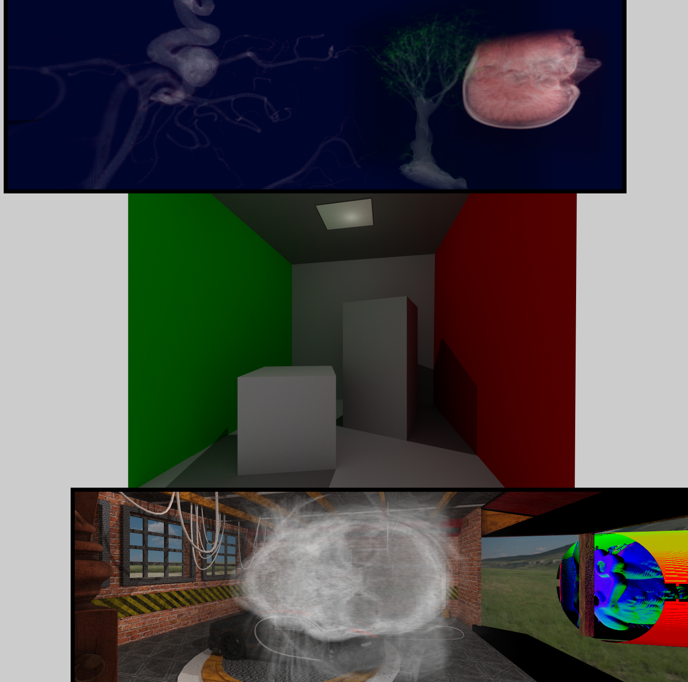
</td>
<td valign="top">

### FCE / FGE — Real-Time Ray Tracing Engine — 2025-2026

Real-time interactive engine built around a layered architecture. **FCE** contains the runtime side. It manages the application, the objects, the components, the scripting, the input and the scene updates. **FGE** contains the rendering side. It is based on DirectX 12 and DXR. It implements the scene representation, the acceleration structures, the materials, the textures and the lighting.

The goal is to study low-level GPU rendering through a complete engine. The project focuses on scene management, ray tracing pipelines, shader organization, GPU memory management and rendering abstraction. It is also used as a base for testing new rendering ideas in real time.

The current engine supports real-time scene updates, a component-based runtime, multiple cameras, a Phong integrator, a minimal path tracer and volume rendering. The main objective is to design a renderer and an engine together, while keeping explicit control over the architecture and the GPU pipeline.

→ <a href="https://github.com/Founzo77/FCE---2025-2026-">FCE (runtime), FGE (renderer) — 2025-2026</a>

</td>
</tr>
</table>

---

<table>
<tr>
<td width="38%" valign="middle">

</td>
<td valign="top">

### FGEIA / FGEWA — ANARI Integration — 5th year

This part focuses on rendering abstraction and interoperability. FGEIA exposes my renderer as an ANARI implementation. FGEWA corresponds to the backend side used to connect the abstraction layer to different rendering implementations.

The objective is to validate the renderer through another API layer. It also allows the comparison of several ANARI backends such as VisRTX, Visionaray and Barney. This work is used to study backend abstraction, device integration and API portability for rendering.

This project is mainly about architecture. It is less focused on visual features and more focused on how a renderer can be integrated into a generic rendering ecosystem.

→ <a href="https://github.com/Founzo77/FCE---2025-2026-">FGEIA (ANARI implementation) / FGEWA (ANARI wrapper) — 5th-year 2nd-semester-2026</a>

</td>
</tr>
</table>

---

<table>
<tr>
<td width="38%" valign="middle">
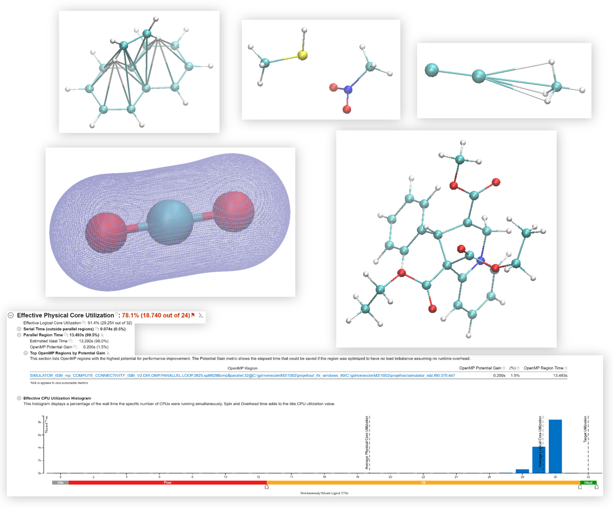
</td>
<td valign="top">

### Quantum Cube & Connectivity — 5th year

Fortran HPC project for molecular orbital cube computation and atomic connectivity analysis from WFX files. The code computes molecular orbital energy cubes, molecular energy density and connectivity metrics for atoms and fragments.

The project targets scientific computing and code optimization. It studies SoA layouts, loop reordering, vectorization, OpenMP parallelization and GPU offloading. It also uses Intel Advisor and VTune to analyze roofline behavior, memory pressure and scalability.

A second important part is the connectivity computation. It includes an ISBI-based metric and support for promolecular models. The project is therefore both a numerical code and an introduction to HPC-oriented quantum chemistry workflows.

→ <a href="https://github.com/Founzo77/Quantum-Cube-Connectivity---5th-year-2nd-semester-2026--">Quantum-Cube-Connectivity---5th-year-2nd-semester-2026--</a>

</td>
</tr>
</table>

---

<table>
<tr>
<td width="38%" valign="middle">
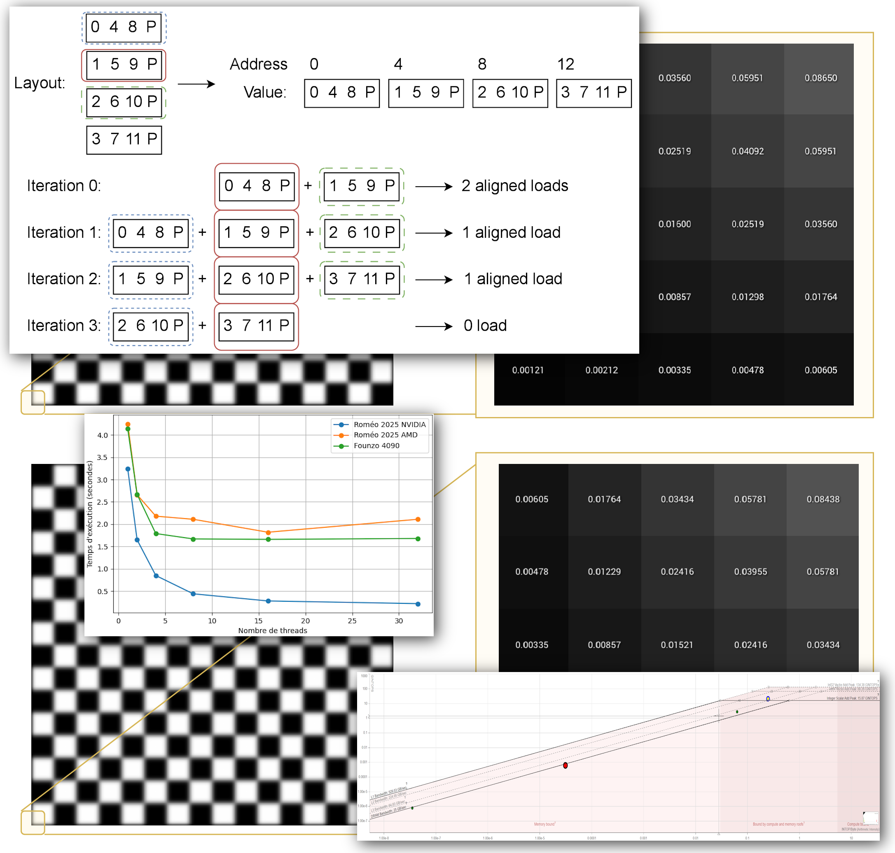
</td>
<td valign="top">

### 5-Point Stencil Optimization — 5th year

CPU optimization project centered on a stencil kernel. The work starts from a naïve scalar version and progressively introduces float reduction, SIMD vectorization, cache tiling, custom memory layouts and temporal blocking.

The project is used to study where performance is lost on modern CPUs. It focuses on memory bandwidth, cache reuse, alignment, compiler behavior and multithreading. The final analysis uses Intel Advisor and VTune to show the memory-bound nature of the optimized versions.

This project is mainly about performance methodology. It does not only optimize code. It also explains why the code behaves this way.

→ <a href="https://github.com/Founzo77/5-Point-Stencil-CPU-5th-year---1st-semester-2025-">5-Point-Stencil-CPU-5th-year---1st-semester-2025-</a>

</td>
</tr>
</table>

---

<table>
<tr>
<td width="38%" valign="middle">
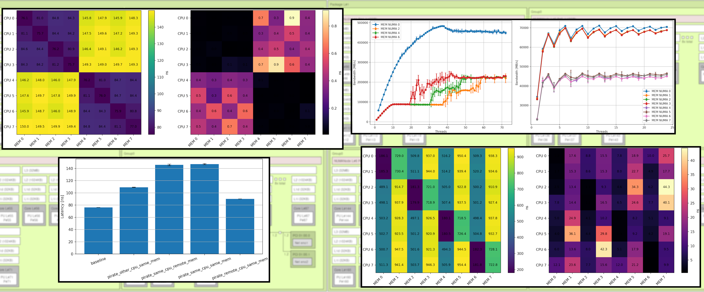
</td>
<td valign="top">

### NUMA Effects Analysis — 5th year

HPC project dedicated to the study of NUMA effects on the Roméo 2025 supercomputer. The work compares ARM NVIDIA Grace nodes and x64 AMD EPYC nodes. It focuses on bandwidth saturation, memory latency, thread placement and inter-node contention.

The analysis is based on STREAM and Multichase. The objective is to understand how topology changes memory behavior. The project studies local and remote memory accesses, scalability with the number of NUMA nodes, application interference and the impact of hybrid cores or hyperthreading.

This project is mainly experimental. It aims to characterize the machine and to explain which memory effects dominate performance.

→ <a href="https://github.com/Founzo77/Analysis-of-NUMA-effects---5th-year-2nd-semester-2026-">Analysis-of-NUMA-effects---5th-year-2nd-semester-2026-</a>

</td>
</tr>
</table>

---

<table>
<tr>
<td width="38%" valign="middle">
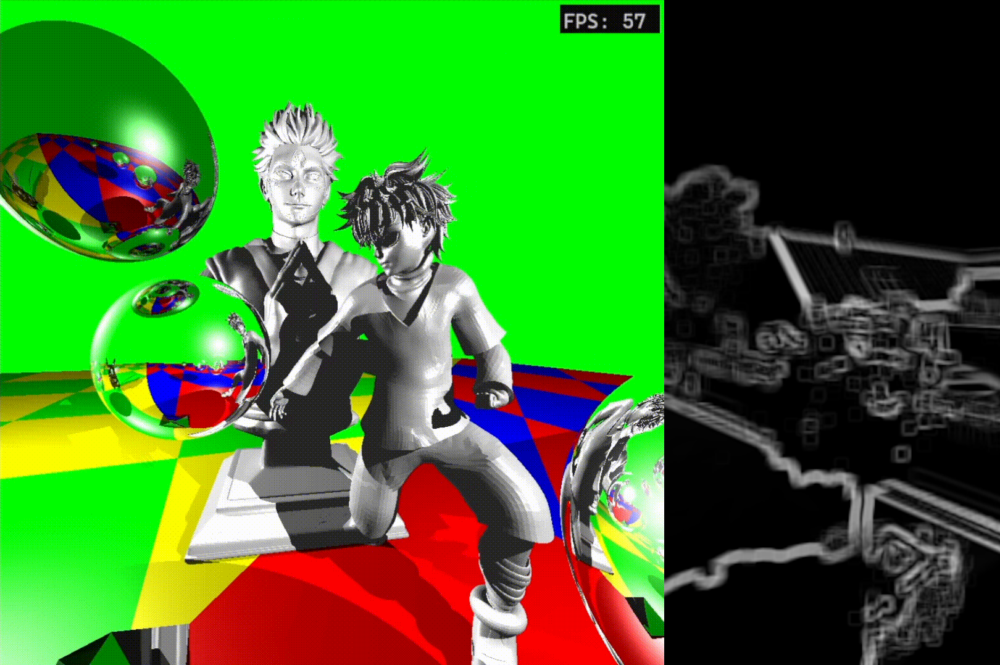
</td>
<td valign="top">

### CUDA Ray Tracer — 4th year

GPU ray tracer implemented in CUDA C++. The renderer supports spheres, triangles, materials, lighting and BVH acceleration. It also includes an interactive visualization mode through OpenGL interop.

The project is used to study GPU programming more directly than with DXR. It focuses on kernels, device memory, acceleration structures, rendering loops and performance profiling. Several executables are used for real-time display, frame timing and kernel-level benchmarking.

This work is centered on CUDA rendering and the implementation of a complete GPU pipeline for interactive scenes.

→ <a href="https://github.com/Founzo77/GPU-Ray-Tracer-4th-year---2nd-semester-2025-">GPU-Ray-Tracer-4th-year---2nd-semester-2025-</a>

</td>
</tr>
</table>

---

<table>
<tr>
<td width="38%" valign="middle">
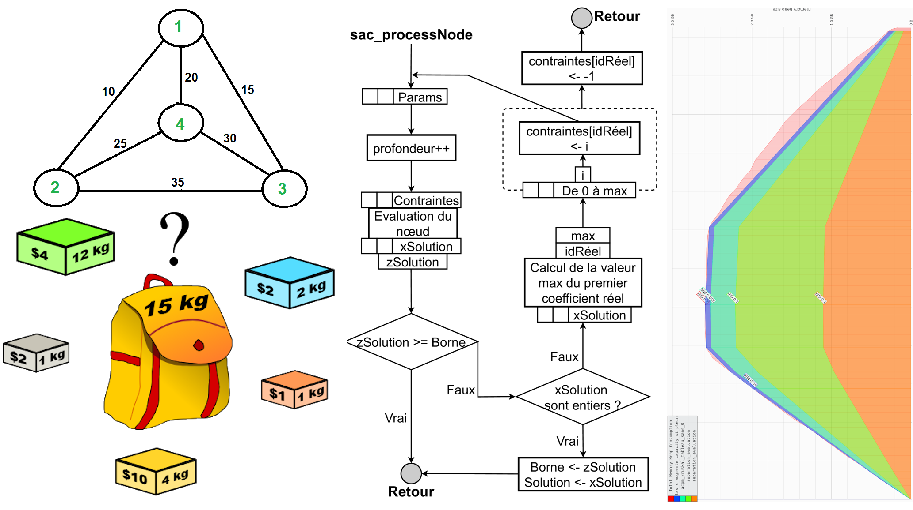
</td>
<td valign="top">

### Knapsack & TSP Solvers — 4th year

Project on combinatorial optimization. It implements several strategies for the knapsack problem and the travelling salesman problem. The objective is to compare algorithmic choices, parallel exploration and practical performance.

The knapsack part includes recursive, iterative and OpenMP versions. The TSP part combines greedy ideas and graph-based evaluation. The project also compares the custom implementations with OR-Tools and includes profiling, memory measurements and benchmark campaigns.

This project mainly targets algorithm design, search strategies and empirical evaluation.

→ <a href="https://github.com/Founzo77/Knapsack-TSP-Solvers-4th-year---2nd-semester-2025-">Knapsack-TSP-Solvers-4th-year---2nd-semester-2025-</a>

</td>
</tr>
</table>

---

<table>
<tr>
<td width="38%" valign="middle">
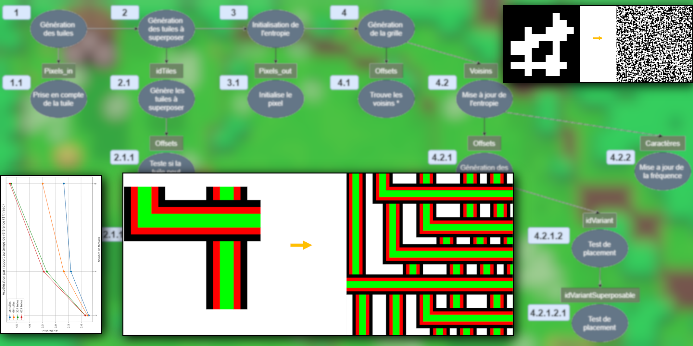
</td>
<td valign="top">

### Wave Function Collapse — 4th year

C++ implementation of a simplified Wave Function Collapse algorithm. The code includes a sequential version and a parallel version based on OpenMP tasks. The goal is to generate tile-based outputs while preserving local adjacency constraints.

The project studies constraint propagation, entropy reduction and the effect of task parallelism on this type of algorithm. It also includes unit tests, data conversion tools and benchmark scripts.

This work is mainly about parallel algorithm design. It looks at how an irregular propagation process behaves under task-based execution.

→ <a href="https://github.com/Founzo77/Wave-Function-Collapse-4th-year---2nd-semester-2025-">Wave-Function-Collapse-4th-year---2nd-semester-2025-</a>

</td>
</tr>
</table>

---

<table>
<tr>
<td width="38%" valign="middle">
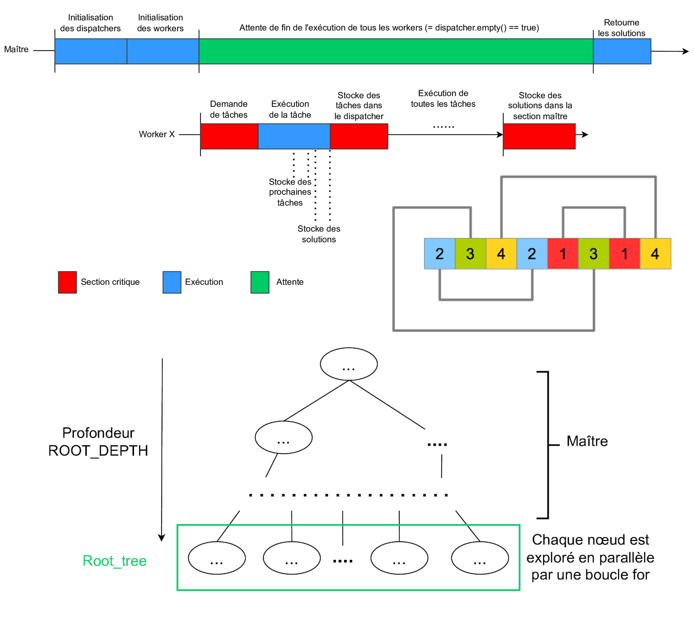
</td>
<td valign="top">

### Langford Pairing Problem — 4th year

Parallel C++ solver for the Langford problem. Several execution strategies are implemented with OpenMP and MPI. The project compares task distribution methods, synchronization policies and scalability.

The code is instrumented to collect timing, memory usage and execution events. It also includes Python post-processing scripts to visualize the behavior of the different strategies. The main interest of the project is the comparison of several parallel designs on the same combinatorial problem.

This project focuses on parallel runtime behavior and performance observation.

→ <a href="https://github.com/Founzo77/Langford-Problem-4th-year---1st-semester-2024-">Langford-Problem-4th-year---1st-semester-2024-</a>

</td>
</tr>
</table>

---

<table>
<tr>
<td width="38%" valign="middle">
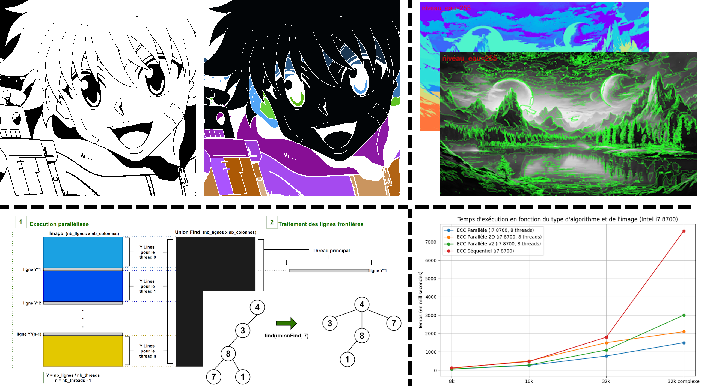
</td>
<td valign="top">

### Image Segmentation Algorithms — 4th year

Project on several image segmentation methods. It includes Union-Find connected components, Prim-based segmentation and Watershed-based region growing. The aim is to compare different algorithmic viewpoints for the same general problem.

The project mixes C++ and Python. It studies both implementation details and segmentation quality. Some parts also include performance measurements and parallelization ideas, especially around Union-Find.

This work is mainly focused on graph algorithms, image processing and algorithmic experimentation.

→ <a href="https://github.com/Founzo77/Image-Segmentation-Algorithms-4th-year---1st-semester-2024-">Image-Segmentation-Algorithms-4th-year---1st-semester-2024-</a>

</td>
</tr>
</table>

---

<table>
<tr>
<td width="38%" valign="middle">
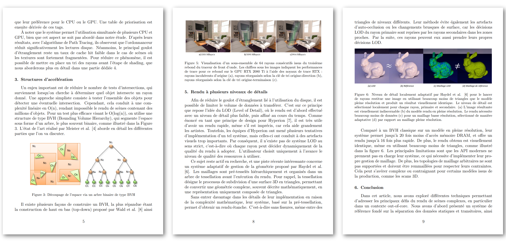
</td>
<td valign="top">

### Literature Review on Out-of-Core Ray Tracing — 4th year

Literature review dedicated to out-of-core ray tracing. The subject is the rendering of scenes that do not fit in main memory. The work studies data management, acceleration structures, ray sorting and level-of-detail approaches.

The objective is to understand how rendering systems remain efficient when geometry and data exceed memory capacity. This includes the relation between CPU, GPU, storage and scene organization.

This project is more theoretical than the others. It focuses on rendering methods, system constraints and state-of-the-art analysis.

→ <a href="https://github.com/Founzo77/Literature-Review-Out-of-Core-RT-4th-year---2nd-semester-2025-">Literature-Review-Out-of-Core-RT-4th-year---2nd-semester-2025-</a>

</td>
</tr>
</table>

---

<table>
<tr>
<td width="38%" valign="middle">
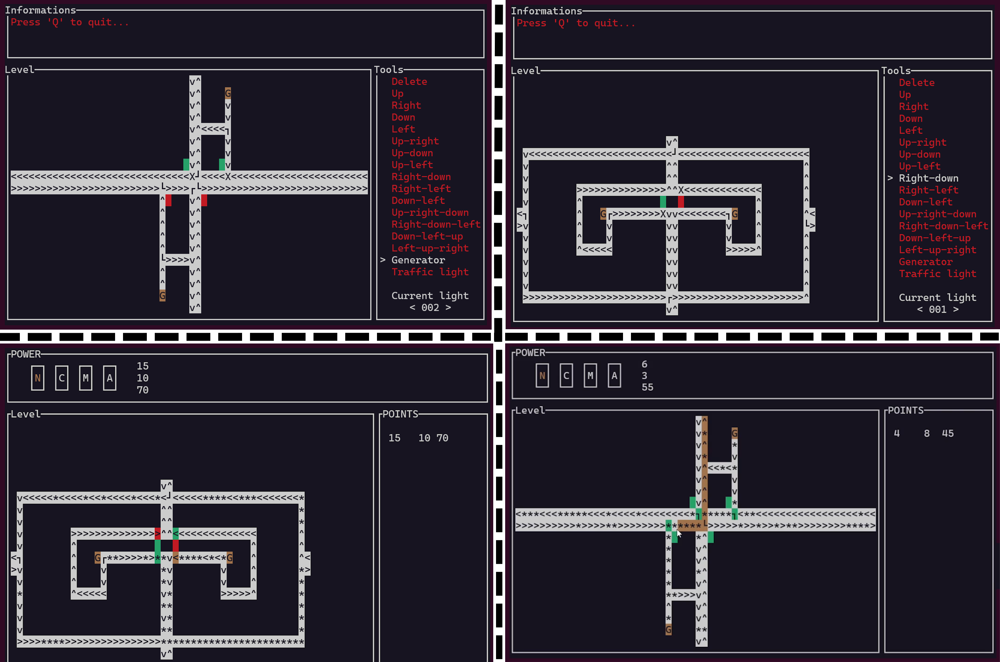
</td>
<td valign="top">

### Need For Curses — 3rd year

Text-based multiplayer game written in C. It combines ncurses rendering, TCP/UDP networking, multithreading and simulation logic. The code includes a client, a server, a map editor and a custom text rendering API.

The project focuses on low-level systems programming. It deals with threads, synchronization, shared state, communication protocols and debugging of concurrent code. It also includes logging tools, error handling helpers and robustness checks.

This project is mainly about systems design in C and the implementation of a complete interactive application.

→ <a href="https://github.com/Founzo77/Need-For-Curses-3rd-year---2nd-semester-2024-">Need-For-Curses-3rd-year---2nd-semester-2024-</a>

</td>
</tr>
</table>

---

<table>
<tr>
<td width="38%" valign="middle">
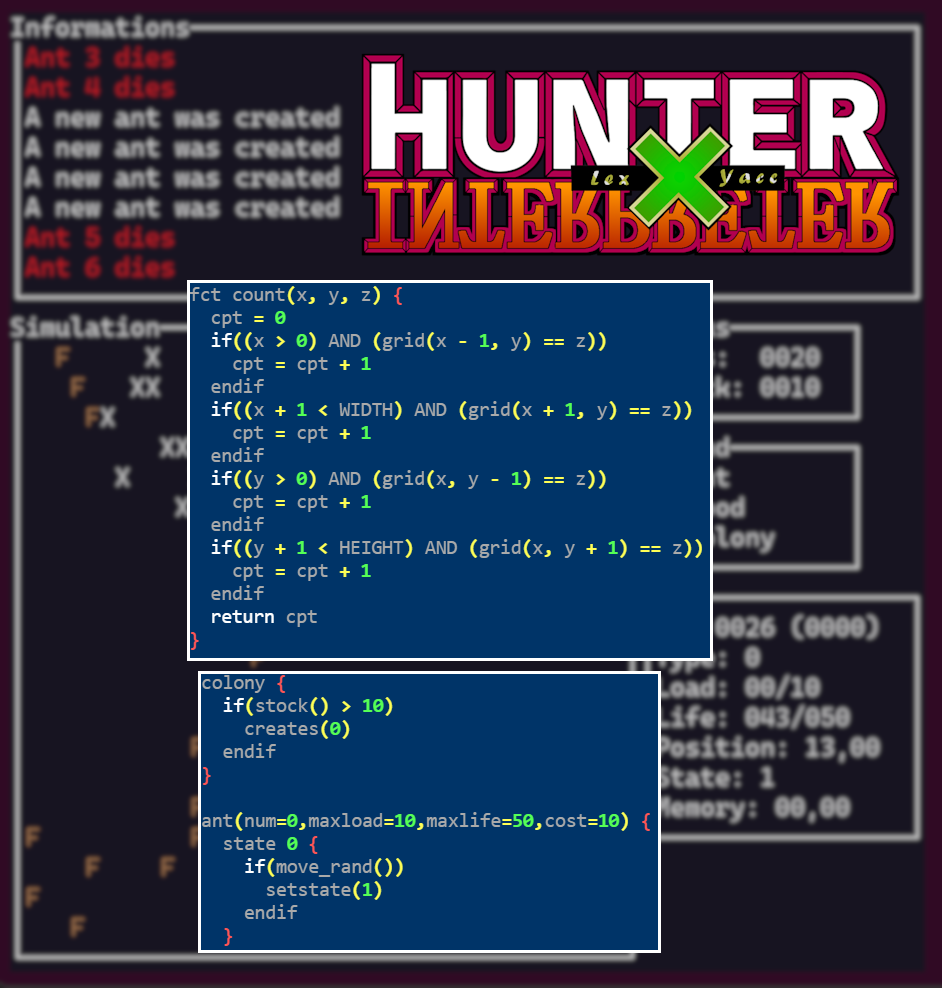
</td>
<td valign="top">

### Hunter x Interpreter — 3rd year

Interpreter written in C with Lex and Yacc. The language is used to describe ant colony behaviors and execution rules on a grid. The project includes lexical analysis, parsing, semantic structures and runtime execution.

The objective is to understand compiler construction through a complete small language. The code handles functions, procedures, control flow, symbol tables and structured error reporting. A ncurses-based simulation is added to visualize the interpreted behavior.

This work targets language implementation and the internal structure of interpreters.

→ <a href="https://github.com/Founzo77/Hunter-x-Interpreter-3rd-year---2nd-semester-2024-">Hunter-x-Interpreter-3rd-year---2nd-semester-2024-</a>

</td>
</tr>
</table>

---

<table>
<tr>
<td width="38%" valign="middle">
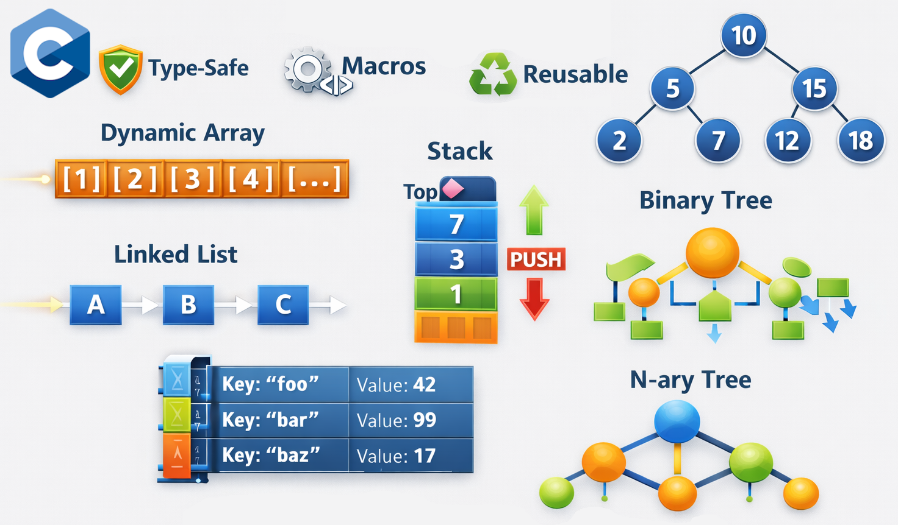
</td>
<td valign="top">

### C_Struct — 2nd-3rd year

Personal C library of generic data structures built with macros. It provides dynamic arrays, lists, queues, stacks, maps, symbol tables and several iterators. The objective is to obtain reusable structures in pure C without native generics.

The project focuses on type reuse, API design and low-level implementation details. It was built to avoid rewriting the same containers in several projects. It also served as a base for cleaner implementations in later C projects.

This work is mainly about reusable infrastructure and generic programming in C.

→ <a href="https://github.com/Founzo77/C_Struct-2nd-3rd-year---2023-2024-">C_Struct-2nd-3rd-year---2023-2024-</a>

</td>
</tr>
</table>

---

<table>
<tr>
<td width="38%" valign="middle">
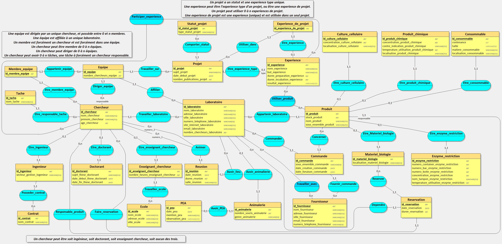
</td>
<td valign="top">

### Lab'Online — 3rd year

Database modeling project centered on the organization of a scientific laboratory. It uses Oracle SQL and PL/SQL. The work includes conceptual modeling, relational design, normalization, data generation and advanced SQL queries.

The objective is to move from a real domain description to a consistent database structure. The project also includes PL/SQL procedures, triggers and analytical queries on the resulting schema.

This work is mainly focused on data modeling and relational design.

→ <a href="https://github.com/Founzo77/Lab-Online-3rd-year---2023-1st-semester-">Lab-Online-3rd-year---2023-1st-semester-</a>

</td>
</tr>
</table>

