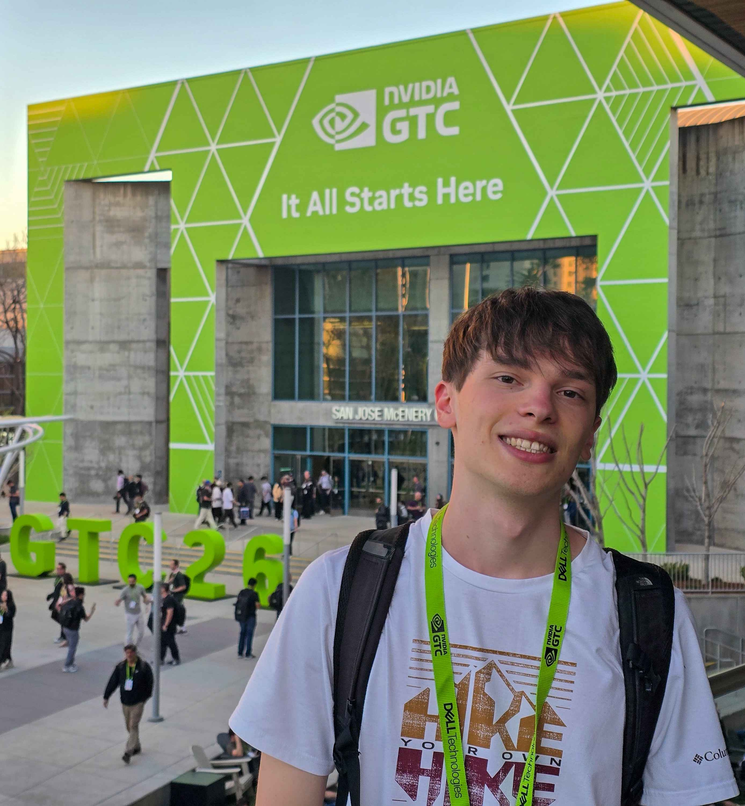

<table>
<tr>
<!-- LEFT COLUMN -->
<td width="30%" valign="top">

<h2>Timothé Kruk</h2>

<b>HPC Developer</b> 
GPU Computing 
Physics-Based Rendering

<a href="https://www.linkedin.com/in/timothe-kruk">LinkedIn</a>

 

<b>Personality</b> 
Passionate · Curious · Autonomous

 

<b>Interests</b> 
Chess · Computing · Drawing 
Video Games (Top 5000 Fortnite Reload)

</td>

<!-- RIGHT COLUMN -->
<td width="70%" valign="top">

<h2>Profile</h2>

A developer passionate about high-performance computing, GPU computing, and physics-based rendering.
As a dedicated engineering student, I am eager to deepen my expertise by working on demanding technical challenges.
Independent and meticulous, I enjoy gaining in-depth knowledge of systems and building robust and optimized solutions.

---

<h2>Education</h2>

<ul>
<li>
<b>Master CHPS (High Performance Computing & Simulation)</b> — URCA, Reims 
<i>Currently M2</i> — M1 Major, High Honors
</li>
<li>
<b>BSc Computer Science</b> — URCA, Reims 
Major of promotion — High Honors
</li>
</ul>

---

<h2>Experience</h2>

<ul>
<li>
<b>Research Apprentice — LICIIS Laboratory</b> (2024 – Present) 
Supervised by Laurent Lucas 
Research on <b>physics-based vegetation rendering</b>
</li>

<li>
<b>Software Developer Intern — Nanogiga</b> (Apr – Sep 2024) 
Development of internal tools and software solutions
</li>
</ul>

</td>
</tr>
</table>

---

<h2>Skills & Projects</h2>

<ul>

  <li>
    <b>GPU Programming / Rendering</b> 
    → <a href="https://github.com/Founzo77/FCE---2025-2026-">DX12 Ray Tracing Engine</a> 
    Real-time renderer with GPU-driven pipeline, scenes, cameras and runtime systems
      
    → <a href="https://github.com/Founzo77/GPU-Ray-Tracer-4th-year---2nd-semester-2025-">CUDA Ray Tracer</a> 
    BVH acceleration, OpenGL interop, real-time rendering pipeline
  </li>

   

  <li>
    <b>High Performance Computing (HPC)</b> 
    → <a href="https://github.com/Founzo77/5-Point-Stencil-CPU-5th-year---1st-semester-2025-">5-Point Stencil Solver</a> 
    SIMD vectorization, cache tiling, temporal blocking, cross-architecture benchmarking
      
    → <a href="https://github.com/Founzo77/Langford-Problem-4th-year---1st-semester-2024-">Langford Parallel Solver</a> 
    OpenMP / MPI parallelism with profiling and performance analysis
  </li>

   

  <li>
    <b>Algorithms & Optimization</b> 
    → <a href="https://github.com/Founzo77/Knapsack-TSP-Solvers-4th-year---2nd-semester-2025-">KP / TSP Solvers</a> 
    Parallel heuristics, combinatorial optimization and benchmarking
  </li>

   

  <li>
    <b>Procedural Generation</b> 
    → <a href="https://github.com/Founzo77/Wave-Function-Collapse-4th-year---2nd-semester-2025-">Wave Function Collapse</a> 
    Sequential and OpenMP implementations with performance comparison
  </li>

   

  <li>
    <b>Systems & Low-level Programming</b> 
    → <a href="https://github.com/Founzo77/C_Struct-2nd-3rd-year---2023-2024-">Generic C Containers</a> 
    Macro-based reusable data structures in C
  </li>

</ul>

---

<h2>Personality</h2>

Passionate · Curious · Autonomous

---

<h2>Interests</h2>

Chess · Computing · Drawing · Video Games (Top 5000 Fortnite Reload)

